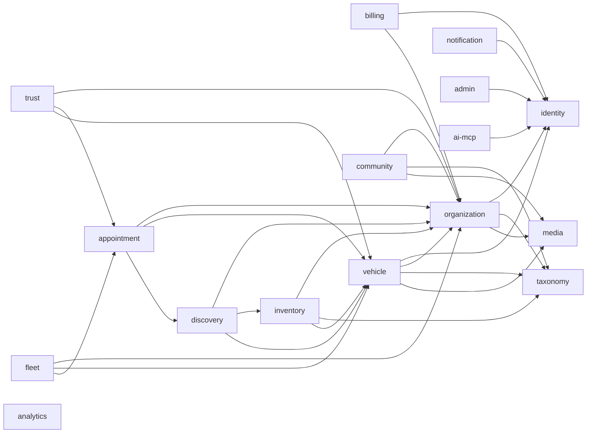

# CarPal MVP — Entity Relationship Map

**Complies with:** [02.Detailed project plan.md](02.Detailed%20project%20plan.md), [50.MVP data model spec.md](50.MVP%20data%20model%20spec.md) and [52.MVP Data Dictionary.md](52.MVP%20Data%20Dictionary.md). Entity names, ownership and fields are defined in 50 and 52. This document shows only **how entities relate**.

---

# 1. Legend

| Symbol | Meaning |
|---|---|
| `1` | Exactly one |
| `0..1` | Zero or one |
| `*` | Zero or many |
| `1..*` | One or many |
| `──` | Same-module reference (database foreign key) |
| `⇢` | Cross-module reference (`xref` in 52): stored ID, no foreign key, validated through the owning module (Plan §14.5) |
| `~>` | Polymorphic reference (`*_type` + `*_id`) |
| `[module]` | Owning backend module (Plan §1.2) |

---

# 2. Module-Level Map

Arrows point from the referencing module to the referenced module.



Geo services (OpenStreetMap tiles, the self-hosted geocoder, directions deep links) are infrastructure and region configuration (Plan §9.7, §3.5), not entities. They add no module and no table; they use `OrganizationLocation` coordinates and `MatchSession` / `MatchResult` only.

Every module also publishes domain events through `DomainEventOutbox` (50 §20). `ai-mcp` reads every module **only** through MCP resources and tools. `admin` and `analytics` refer to any entity polymorphically (§19).

## 2.1 Core spine

```text
UserAccount [identity]
  ├── 1..* RoleMembership ⇢ 0..1 Organization
  ├── 1    UserPreference
  ├── *    ConsentRecord
  ├── *    Vehicle (owner)                [vehicle]
  ├── *    Review (author)                [trust]
  ├── *    ReviewRequest (invited)        [trust]
  └── *    Appointment (requester)        [appointment]

Organization [organization]
  ├── 1..* OrganizationLocation
  ├── 0..1 ProviderProfile / VendorProfile (both if hybrid)
  ├── 0..1 FleetProfile                   [fleet]
  ├── 1    active Subscription ⇢ Plan     [billing]
  ├── *    Vehicle (fleet-owned)          [vehicle]
  ├── *    Review (subject)               [trust]
  ├── *    Appointment (provider)         [appointment]
  └── *    InventoryItem (vendor)         [inventory]

Vehicle [vehicle]
  ├── *    VehicleServiceRecord ── *  ServiceRecordEvidence
  ├── *    VehicleIssue
  ├── *    Appointment                    [appointment]
  └── 0..1 active FleetVehicleAssignment  [fleet]

TaxonomyNode [taxonomy]
  └── classifies capabilities, coverage, catalog, fitment, vehicles,
      issues, symptoms, reviews, Q&A, posts, matching
```

---

# 3. Identity & Access [identity]

```text
UserAccount
  ├── 1..* AuthenticationMethod
  ├── 1    UserPreference ── 0..1 RoleMembership (default context)
  ├── 1..* RoleMembership ⇢ 0..1 Organization   (none for individual / platform roles)
  ├── *    ConsentRecord ~> scope entity (vehicle, appointment, media, ...)
  │                      ⇢ grantee (Organization / McpClient)
  ├── *    DataSubjectRequest ⇢ 0..1 MediaAsset (export file)
  └── *    OnboardingProgress ⇢ 0..1 Organization, 0..1 assisting staff UserAccount
```

| Entity A | Relationship | Entity B | Cardinality | Notes |
|---|---|---|---|---|
| UserAccount | has | AuthenticationMethod | 1..* | Password, OTP, OIDC, TOTP |
| UserAccount | has | UserPreference | 1 | Created with the account |
| UserAccount | has | RoleMembership | 1..* | Always includes the implicit `individual` role |
| RoleMembership | in | Organization | 0..1 | Null for `individual` and `platform_*` roles |
| UserAccount / Organization | gives | ConsentRecord | * | Subject is a user or an organization |
| ConsentRecord | scoped to | any entity | 0..1 | Polymorphic scope |
| ConsentRecord | granted to | Organization / McpClient | 0..1 | e.g. one provider |
| UserAccount | files | DataSubjectRequest | * | Export, deletion, rectification, withdrawal |
| UserAccount | has | OnboardingProgress | * | One per flow. Staff can run a business flow on the owner's behalf (`assisted`, audited). |
| UserAccount | holds | `trusted_user` flag | 0..1 | Post-MVP hook only: later gives a limited review-approval queue |
| RoleMembership | grants | `platform_community_reviewer` role | 0..1 | The "social admin" who approves reviews without a visit; staff in the MVP |

---

# 4. Organizations & Profiles [organization]

```text
Organization
  ├── 1..* OrganizationLocation
  ├── *    OrganizationVerification ⇢ * MediaAsset (documents)
  ├── 0..1 Organization (merged_into)
  │
  ├── 0..1 ProviderProfile
  │        ├── *  ProviderCertification ⇢ 0..1 MediaAsset
  │        ├── *  ProviderServiceCategory ⇢ 1 TaxonomyNode
  │        ├── *  ProviderVehicleCoverage ⇢ TaxonomyNode (brand/model/series/engine/fuel)
  │        ├── *  ProviderCapability ⇢ TaxonomyNode (brand/model/series/system/task)
  │        │        └── * ProviderCapabilityEvidence ~> appointment | review | portfolio
  │        │                                            | service record | certification | job log
  │        ├── *  ProviderJobLog ⇢ 0..1 Vehicle / Appointment / VehicleServiceRecord
  │        ├── *  ProviderCustomerNote ⇢ 1 UserAccount (customer), 0..1 Vehicle
  │        └── *  PortfolioItem ── 0..1 ProviderJobLog
  │                 ⇢ 0..1 VehicleServiceRecord / Appointment / ConsentRecord / AiInsight
  │
  └── 0..1 VendorProfile
           └── *  VendorCoverage ⇢ 1 TaxonomyNode
```

`OrganizationLocation` carries the map pin (`geo_source`: owner pin, geocoded, admin-corrected), the pin-versus-address check result, `public_address_visibility` (exact or approximate) and a service radius circle. Wrong-location reports reach it as a `ContentReport` (§16).

Provider-side entities are keyed by the provider's `organization_id`. Vendor-side entities are keyed by the vendor's `organization_id`. A hybrid organization has both profiles.

| Entity A | Relationship | Entity B | Cardinality | Notes |
|---|---|---|---|---|
| Organization | has | OrganizationLocation | 1..* | Exactly one primary; one pin per location on the map |
| Organization | has | OrganizationVerification | * | One per check type over time |
| Organization | has | ProviderProfile | 0..1 | Provider or hybrid |
| Organization | has | VendorProfile | 0..1 | Vendor or hybrid |
| Provider | has | ProviderCertification | * | Verified ones become evidence |
| Provider | has | ProviderServiceCategory | * | Service catalog; ≥1 to publish |
| Provider | has | ProviderVehicleCoverage | * | Unlimited; ≥1 brand to publish |
| Provider | has | ProviderCapability | * | Capability matrix |
| ProviderCapability | has | ProviderCapabilityEvidence | * | Weighted per [54 §1](54.Scoring%20Protocol.md) |
| ProviderCapabilityEvidence | points to | evidence entity | 1 | Polymorphic |
| Provider | logs | ProviderJobLog | * | Job evidence |
| Provider | keeps | ProviderCustomerNote | * | Org-private |
| Provider | has | PortfolioItem | * | Before/after showcase |
| Vendor | has | VendorCoverage | * | Brands, models, part categories |

---

# 5. Plans & Entitlements [billing]

```text
Plan
  ├── *  Entitlement
  └── *  Subscription ⇢ 1 subscriber (UserAccount or Organization)
```

| Entity A | Relationship | Entity B | Cardinality | Notes |
|---|---|---|---|---|
| Plan | defines | Entitlement | * | Unique key per plan |
| Plan | used by | Subscription | * | |
| UserAccount / Organization | has | Subscription | 1 active (+ history) | Every user gets Individual Free |

---

# 6. Taxonomy [taxonomy]

```text
TaxonomyNode
  ├── 0..1 parent TaxonomyNode           (brand → model → series; system → task; ...)
  ├── 0..1 merged_into TaxonomyNode
  ├── *    TaxonomySynonym
  └── *    TaxonomyMapping (as source or target)
             symptom → system | task;  part category → system;  task → part category
```

Referenced (`⇢`) by:

| Module | Entities |
|---|---|
| organization | ProviderServiceCategory, ProviderVehicleCoverage, ProviderCapability, ProviderCertification (scope), ProviderJobLog, PortfolioItem, VendorCoverage, ProviderProfile (amenities) |
| vehicle | Vehicle, VehicleServiceRecord, VehicleIssue |
| inventory | InventoryItem, InventoryFitment |
| discovery | MatchSession |
| trust | Review, ReviewTag, TrustSignal (scope), ProviderBadge (scope) |
| appointment | Appointment, PreVisitReport |
| fleet | FleetPreferredPartner |
| community | Post, Question |
| ai-mcp | TriageSession, SkillHeatmapEntry |

---

# 7. Vehicles & Service History [vehicle]

```text
Vehicle ~> owner (UserAccount | fleet Organization)
  ├── *  VehicleStatusHistory
  ├── *  VehicleMileageLog
  ├── *  VehicleDocument ⇢ 1 MediaAsset
  ├── *  VehicleServiceRecord
  │        ├── *    ServiceRecordEvidence ⇢ 0..1 MediaAsset | ~> appointment record
  │        ├── 0..1 resolves VehicleIssue
  │        ⇢ 0..1 provider Organization, Appointment, ProviderJobLog, AiInsight
  ├── *  VehicleIssue
  │        ⇢ 0..1 TriageSession, AiInsight, Appointment (converted)
  ├── *  MaintenanceReminder ⇢ 0..1 AiInsight
  └── ⇢ 0..1 MediaAsset (primary photo)
```

| Entity A | Relationship | Entity B | Cardinality | Notes |
|---|---|---|---|---|
| UserAccount | owns | Vehicle | * | Active count ≤ plan `max_vehicles` |
| Organization (fleet) | owns | Vehicle | * | Active count ≤ plan `max_vehicles` |
| Vehicle | has | VehicleStatusHistory | 1..* | Feeds downtime |
| Vehicle | has | VehicleMileageLog | * | Latest value mirrored on Vehicle |
| Vehicle | has | VehicleDocument | * | Private, encrypted media |
| Vehicle | has | VehicleServiceRecord | * | All MVP sources |
| VehicleServiceRecord | has | ServiceRecordEvidence | * | Invoice, photo, document, appointment record |
| VehicleServiceRecord | resolves | VehicleIssue | 0..1 | |
| Vehicle | has | VehicleIssue | * | |
| VehicleIssue | becomes | Appointment | 0..1 | |
| Vehicle | has | MaintenanceReminder | * | |

---

# 8. Vendor Inventory [inventory]

```text
vendor Organization
  ├── *  InventoryItem
  │        ├── *    InventoryFitment ⇢ TaxonomyNode (brand/model/series/engine/fuel)
  │        ├── 0..1 duplicate_of InventoryItem
  │        ├── 0..1 InventoryImportBatch
  │        ⇢ 1 TaxonomyNode (part category), 0..1 OrganizationLocation
  │        └── *    StockInquiry ⇢ requester UserAccount, 0..1 requester Organization,
  │                    0..1 Vehicle, 0..1 ConsentRecord
  │                    └── * InquiryMessage
  ├── *  VendorTradeAccount ⇢ 1 trade customer Organization (provider/fleet)
  └── *  InventoryImportBatch ⇢ MediaAsset (CSV, error report)
```

| Entity A | Relationship | Entity B | Cardinality | Notes |
|---|---|---|---|---|
| Vendor | owns | InventoryItem | * | Tenant-isolated (RLS) |
| InventoryItem | has | InventoryFitment | * | Confidence per [54 §7](54.Scoring%20Protocol.md) |
| InventoryItem | receives | StockInquiry | * | No checkout |
| StockInquiry | has | InquiryMessage | 1..* | Thread-ready for live chat |
| Vendor | approves | VendorTradeAccount | * | Unique per vendor + customer |
| VendorTradeAccount | unlocks | trade-only items and trade prices | — | For the customer organization's users |
| Vendor | runs | InventoryImportBatch | * | CSV import |

---

# 9. Discovery & Matching [discovery]

```text
MatchSession ⇢ requester UserAccount, 0..1 Organization (fleet),
               0..1 Vehicle, VehicleIssue, 0..1 TriageSession, TaxonomyNode filters
               (direct search and map browsing have no TriageSession;
                the interpreted intent and map viewport are stored on the session)
  └── *  MatchResult ~> target (Organization | InventoryItem)
           ⇢ 0..1 AiInsight (explanation), 0..1 Appointment (outcome)
           (map pins are one per business location, built from MatchResults)

Search projections (Elasticsearch) — derived from events, not related by keys:
  ProviderSearchDoc, VendorSearchDoc, InventorySearchDoc, CommunitySearchDoc, TaxonomySearchDoc
```

| Entity A | Relationship | Entity B | Cardinality | Notes |
|---|---|---|---|---|
| MatchSession | produces | MatchResult | * | Organic results. Featured results are reserved (flag off in the MVP) and never on the map. |
| MatchSession | may reference | TriageSession | 0..1 | Only when started from Help Me; a search or map session has none |
| MatchSession | may reference | AiInsight (`query_interpretation`) | 0..1 | Optional AI enhancer of the rule-based query interpreter |
| MatchResult | targets | Organization / InventoryItem | 1 | Polymorphic |
| MatchResult | leads to | Appointment | 0..1 | Match acceptance metric |
| Appointment | came from | MatchResult | 0..1 | `match_result_id` |

---

# 10. Reviews & Trust [trust]

```text
Review ⇢ author UserAccount, subject Organization, 0..1 location
       ⇢ 0..1 Vehicle, Appointment, VehicleServiceRecord, StockInquiry
  ├── *    ReviewSubRating        (provider or vendor dimension set)
  ├── *    ReviewTag ⇢ TaxonomyNode (review_tag)
  ├── 0..1 published ReviewResponse ⇢ 0..1 AiInsight (draft)
  ├── 0..1 ReviewRequest (invitation it came from)
  ├── Path 1 (visit-based): evidence = Appointment | StockInquiry | VehicleServiceRecord
  │        → published after automatic checks; the business does not approve
  ├── Path 2 (approval-based): no visit evidence, or written after the 7-day window
  │        ├── business confirmation ⇢ member UserAccount of the subject Organization
  │        ├── CarPal reviewer decision ⇢ staff UserAccount (platform_community_reviewer)
  │        └── 0..1 Dispute (review_approval_objection) if the business rejects
  └── ⇢ *  MediaAttachment (incl. author evidence), Reaction, ContentReport, Dispute

ReviewRequest ⇢ subject Organization, 0..1 invited UserAccount (or invited contact),
                one visit: Appointment | VehicleServiceRecord | StockInquiry | ProviderJobLog,
                0..1 inviting UserAccount (provider or vendor member)
                single-use link token, sent_at, expires_at = sent_at + 7 days
Dispute ~> target (review | service record | badge | appointment | moderation action)
TrustSignal ~> subject (Organization | UserAccount), ⇢ 0..1 TaxonomyNode, AiInsight
ProviderBadge ⇢ provider Organization, * TaxonomyNode (scope)
```

| Entity A | Relationship | Entity B | Cardinality | Notes |
|---|---|---|---|---|
| UserAccount | writes | Review | * | One per context |
| Organization | receives | Review | * | Provider or vendor |
| Review | has | ReviewSubRating | * | One per dimension |
| Review | has | ReviewTag | * | |
| Review | has | ReviewResponse | * (≤ 1 published) | Drafts allowed |
| Appointment / VehicleServiceRecord / StockInquiry | triggers | ReviewRequest | 0..1 | After a completed visit or a `completed` inquiry (either side can complete it) |
| ProviderJobLog / provider records | triggers | ReviewRequest | * | Provider invites a past customer; counts as the business's confirmation (Path 2) |
| ReviewRequest | converts to | Review | 0..1 | Link works once and expires 7 days after sending |
| Review | is confirmed by | Appointment / StockInquiry / VehicleServiceRecord | 0..1 | Path 1; the shop does not approve |
| Review | is confirmed by | business member + CarPal reviewer | 0..2 | Path 2: both approvals needed before publishing |
| Review | may open | Dispute (`review_approval_objection`) | 0..1 | When the business rejects the relationship; decided by CarPal |
| Review | can become | ProviderCapabilityEvidence | 0..1 | Counted reviews only |
| any disputable entity | has | Dispute | * | |
| Organization / UserAccount | has | TrustSignal | * | Per signal type and scope |
| Provider | earns | ProviderBadge | * | Rule-based ([54 §4](54.Scoring%20Protocol.md)) |

---

# 11. Appointments & Calendar [appointment]

```text
Appointment ⇢ requester UserAccount (+ fleet Organization), provider Organization,
              0..1 provider location, Vehicle, 0..1 MatchResult, 0..1 VehicleIssue,
              0..1 TriageSession (none when started from search, map, profile, showcase
              or favourites), FleetApproval, ConsentRecord
  ├── *    AppointmentTimeWindow (≥1 once requested)
  ├── 1..* AppointmentStatusHistory
  ├── *    AppointmentParticipant ⇢ UserAccount
  ├── *    AppointmentNote
  ├── 0..1 PreVisitReport ⇢ 0..1 AiInsight, * MediaAttachment, 0..1 ConsentRecord
  └── on completion ⇢ 0..1 VehicleServiceRecord, 0..1 ReviewRequest,
                      * ProviderCapabilityEvidence

provider Organization
  ├── *  ProviderAvailabilityRule ⇢ OrganizationLocation
  └── *  ProviderTimeOff ⇢ 0..1 OrganizationLocation
```

| Entity A | Relationship | Entity B | Cardinality | Notes |
|---|---|---|---|---|
| UserAccount / fleet | requests | Appointment | * | `requester_type` user or fleet |
| Provider | receives | Appointment | * | |
| Appointment | for | Vehicle | 1 | Required |
| Appointment | has | AppointmentTimeWindow | * | Preferred windows; ≥1 once requested |
| Appointment | has | AppointmentStatusHistory | 1..* | Transitions in 52 §12 |
| Appointment | has | AppointmentParticipant | * | Staff, managers, coordinators, drivers |
| Appointment | has | PreVisitReport | 0..1 | Consent-gated history; "Triage: not provided" when there is no TriageSession |
| Appointment | evidences | Review (Path 1) | * | A confirmed appointment that took place lets the requester review on Path 1 |
| Appointment | creates | VehicleServiceRecord | 0..1 | On completion |
| Appointment | creates | ReviewRequest | 0..1 | On completion |
| Provider | defines | ProviderAvailabilityRule | * | Per location and weekday |
| Provider | defines | ProviderTimeOff | * | Unavailable dates |

---

# 12. Fleet [fleet]

```text
fleet Organization
  ├── 1  FleetProfile
  ├── *  Vehicle (fleet-owned)                 [vehicle]
  │        └── 0..1 active FleetVehicleAssignment ⇢ driver UserAccount
  ├── *  FleetPreferredPartner ⇢ provider / vendor Organization
  ├── *  FleetApproval ⇢ Vehicle, 0..1 VehicleIssue, Appointment, AiInsight,
  │                      selected provider Organization
  ├── *  FleetImportBatch ⇢ MediaAsset
  └── *  FleetExport ⇢ MediaAsset

Workflow: VehicleIssue → FleetApproval (repair_request) → FleetApproval (provider_selection)
          → Appointment → [FleetApproval (cost_estimate)] → VehicleServiceRecord (cost)
          → VehicleStatusHistory (back to active)
```

| Entity A | Relationship | Entity B | Cardinality | Notes |
|---|---|---|---|---|
| Organization (fleet) | has | FleetProfile | 1 | |
| Vehicle | assigned via | FleetVehicleAssignment | * (≤ 1 active) | |
| FleetVehicleAssignment | to | UserAccount (driver) | 1 | |
| Fleet | prefers | Organization | * | Preferred provider or approved vendor |
| VehicleIssue | needs | FleetApproval | 0..* | Per approval type |
| FleetApproval | leads to | Appointment | 0..1 | |
| Fleet | runs | FleetImportBatch / FleetExport | * | Should-have |

---

# 13. Community [community]

```text
UserAccount
  ├── *  Follow   ⇢ Organization
  ├── *  Favorite ⇢ Organization
  ├── *  Question ⇢ 0..1 Vehicle (private), TaxonomyNode (brand/model/series/symptom/category)
  │        ├── *    Answer ⇢ 0..1 author Organization
  │        └── 0..1 accepted Answer
  ├── *  Comment  ~> target (post | portfolio item | question | answer)
  └── *  Reaction ~> target (review | answer | post | comment | portfolio item)

Organization
  └── *  Post ⇢ 0..1 PortfolioItem (showcase / job completion), * TaxonomyNode, 0..1 AiInsight
```

| Entity A | Relationship | Entity B | Cardinality | Notes |
|---|---|---|---|---|
| UserAccount | follows | Organization | * | One active per pair |
| UserAccount | favorites | Organization | * | Matching preference input |
| Organization | publishes | Post | * | Should-have |
| Post | showcases | PortfolioItem | 0..1 | Requires consent |
| UserAccount | asks | Question | * | Should-have |
| Question | has | Answer | * | |
| UserAccount | reacts to | target | * | Helpful / like |

---

# 14. Media [media]

```text
MediaAsset ~> owner (UserAccount | Organization | system)
  ⇢ 0..1 ConsentRecord, 0..1 AiInsight (redaction)
  └── *  MediaAttachment ~> attached entity
           (vehicle, issue, portfolio item, post, review, question, answer,
            inventory item, appointment, job log, organization, user)
           pair_group_key links one "before" with one "after"
```

Direct single-file references (`⇢ MediaAsset`): VehicleDocument, ServiceRecordEvidence, ProviderCertification, OrganizationVerification, Vehicle (primary photo), DataSubjectRequest (export), InventoryImportBatch, FleetImportBatch, FleetExport.

| Entity A | Relationship | Entity B | Cardinality | Notes |
|---|---|---|---|---|
| MediaAsset | attached via | MediaAttachment | * | Same asset can be reused |
| MediaAttachment | to | any attachable entity | 1 | Polymorphic |
| MediaAttachment | paired with | MediaAttachment | 0..1 | Before/after by `pair_group_key` |

---

# 15. Notifications [notification]

```text
UserAccount
  ├── *  Notification ⇢ 0..1 Organization (context) ~> 0..1 referenced entity
  │        └── 1..* NotificationDelivery ── 0..1 PushDeviceToken
  ├── *  NotificationPreference
  └── *  PushDeviceToken
```

Organization-level alerts are fanned out to members as one `Notification` per user.

---

# 16. Admin & Moderation [admin]

```text
ContentReport ~> target ⇢ reporter UserAccount
  (targets include OrganizationLocation: "wrong location or closed")
  └── 0..1 ModerationCase ~> target ⇢ 0..1 AiInsight (AI flag)
             └── * ModerationAction ~> target ⇢ actor UserAccount
                                       ⇢ AuditLog (always)
FeatureFlag            (targeting by role, region, organization, plan)
DataRetentionPolicy    (per entity type)
```

| Entity A | Relationship | Entity B | Cardinality | Notes |
|---|---|---|---|---|
| ContentReport | triaged into | ModerationCase | 0..1 | Several reports can share one case |
| ModerationCase | has | ModerationAction | * | Reason required |
| ModerationAction | writes | AuditLog | 1 | |
| ModerationAction | may create | TrustSignal (`admin_trust_penalty`) / badge revocation | 0..1 | [54 §9](54.Scoring%20Protocol.md) |
| ModerationAction | decides | Review approval (confirm, reject, request evidence) | 0..1 | Path 2 queue; reason required |
| ModerationAction | corrects | OrganizationLocation (pin or address) | 0..1 | Reason required; organization notified; written to AuditLog |

---

# 17. Analytics & Audit [analytics]

```text
AuditLog       ~> any entity, ⇢ actor (user | staff | system | McpClient)
AnalyticsEvent    (analytics database; pseudonymous actor, no foreign keys)
```

---

# 18. AI & MCP [ai-mcp]

```text
McpClient
  └── *  McpAccessLog ⇢ principal, 0..1 ConsentRecord, 0..1 ApprovalRequest, 0..1 AiInsight

AiInsight ~> subject entity, ⇢ 0..1 McpClient
  ├── *    AiSuggestion ⇢ target entity
  ├── *    ApprovalRequest ~> subject entity
  └── *    AiEvaluationRecord

TriageSession ⇢ UserAccount, Vehicle, 0..1 VehicleIssue, MatchSession, Appointment (draft)
  └── 1 result AiInsight
SkillHeatmapEntry ⇢ provider Organization, TaxonomyNode
  └── 1 AiInsight
Embedding ~> source entity (tenant-scoped for private content)
```

| Entity A | Relationship | Entity B | Cardinality | Notes |
|---|---|---|---|---|
| McpClient | generates | McpAccessLog | * | Append-only |
| McpAccessLog | produces | AiInsight | 0..1 | Tool output |
| AiInsight | yields | AiSuggestion | * | Human decides |
| AiInsight | needs | ApprovalRequest | 0..* | Drafts and sensitive actions |
| AiInsight | receives | AiEvaluationRecord | * | Quality metrics |
| TriageSession | produces | AiInsight, MatchSession | 1, 0..1 | "Help Me" |
| Domain entities | reference | AiInsight | * | e.g. issue triage, portfolio caption, review response draft, fitment, match explanation |

---

# 19. Polymorphic References

| Entity | Fields | Can refer to |
|---|---|---|
| Vehicle | `owner_type` + `owner_id` | UserAccount, Organization (fleet) |
| Subscription | `subscriber_type` + `subscriber_id` | UserAccount, Organization |
| ConsentRecord | `subject_*`, `scope_entity_*`, `granted_to_*` | User/Organization; any scoped entity; Organization/McpClient |
| ProviderCapabilityEvidence | `reference_entity_*` | Appointment, Review, PortfolioItem, VehicleServiceRecord, ProviderCertification, ProviderJobLog |
| ServiceRecordEvidence | `reference_entity_*` | Appointment |
| MatchResult | `target_entity_*` | Organization, InventoryItem |
| Dispute | `target_entity_*` | Review, VehicleServiceRecord, ProviderBadge, Appointment, ModerationAction |
| TrustSignal | `subject_*` | Organization, UserAccount |
| Comment / Reaction | `target_*` | Post, PortfolioItem, Question, Answer, Review, Comment |
| MediaAsset / MediaAttachment | `owner_*` / `attached_to_*` | See §14 |
| Notification | `reference_entity_*` | Any |
| ContentReport / ModerationCase / ModerationAction | `target_*` | Any reportable entity, user, organization, AI output |
| AuditLog | `entity_*` | Any |
| AiInsight / AiSuggestion / ApprovalRequest | `subject_*` / `target_*` | Any |
| Embedding | `entity_*` | Provider profile, inventory item, review, question, post, portfolio item, taxonomy node, issue |
| DomainEventOutbox | `aggregate_*` | Any |

Polymorphic references are validated by the owning module when written, and are cleaned up through events when the target is deleted or anonymized.

---

# 20. MVP Flows as Entity Chains (MVP §10)

**Flow 1: individual finds the right specialist**
`UserAccount → Vehicle → TriageSession (+AiInsight) → VehicleIssue → MatchSession → MatchResult → Appointment (+TimeWindow) → PreVisitReport → status history → completed → VehicleServiceRecord + ReviewRequest → Review → ProviderCapabilityEvidence → ProviderCapability (confidence) → SkillHeatmapEntry`

**Flow 2: provider improves trust and rankings**
`ProviderProfile → AiInsight/AiSuggestion (profile helper) → ProviderCapability (approved) → PortfolioItem + MediaAttachment (before/after) → AiInsight (showcase caption) → ApprovalRequest → Post → Review → AiInsight (themes) → ReviewResponse (AI draft) → TrustSignal → ProviderBadge → higher MatchResult rank`

**Flow 3: vendor inventory becomes searchable**
`VendorProfile → InventoryImportBatch → InventoryItem → AiInsight (normalization, fitment) → AiSuggestion accepted → InventoryFitment (confirmed) → InventorySearchDoc → MatchSession (provider) → StockInquiry + InquiryMessage → reserved → Appointment`

**Flow 4: fleet manager handles a breakdown**
`fleet driver UserAccount → VehicleIssue (source fleet_driver) → TriageSession/AiInsight (urgent brakes) → Notification → FleetApproval (repair_request, approved) → MatchSession (near vehicle) → FleetApproval (provider_selection) → Appointment → completed → VehicleServiceRecord (cost) → VehicleStatusHistory (active)`

**Flow 5: individual finds a shop or parts seller without Help Me (MVP §10)**
`UserAccount → Vehicle (optional) → MatchSession (query_normalized + interpreted_intent, no TriageSession) → MatchResult (relevant_to_vehicle) → map pin / list card → Appointment (source direct_search, triage not provided) → PreVisitReport (triage_status not_provided) | StockInquiry → completed → VehicleServiceRecord + ReviewRequest → Review (Path 1)`

**Flow 6: review invitation by email (MVP §10)**
`Appointment completed | ProviderJobLog | StockInquiry completed → ReviewRequest (single-use token, expires_at = sent_at + 7 days) → code check → Review → Path 1: published after automatic checks | Path 2: pending_approval → business confirmation (or 7 days) → CarPal reviewer decision → approved_without_visit (or Dispute review_approval_objection → ModerationAction)`

---

# 21. Key Relationship Rules

## Identity
- A user can belong to many organizations, with one active role per organization, and always has the implicit `individual` role.
- An organization has at most one provider, one vendor and one fleet profile. A hybrid organization has provider and vendor profiles.

## Vehicles
- A vehicle has exactly one owner: a user or a fleet organization.
- A fleet vehicle has at most one active driver assignment.
- Providers and vendors never own customer vehicles. They reach vehicle data only through consent.

## Providers
- Coverage and catalog rows are unlimited.
- Capabilities gain confidence only from active evidence. AI-linked evidence counts only after approval.
- Skill heatmap entries are AI-derived and are never source-of-truth.

## Vendors
- Every inventory item belongs to exactly one vendor and is tenant-isolated.
- Trade-only data is reachable only through an approved `VendorTradeAccount`.

## Reviews
- A review has one author and one subject organization, and at most one published response.
- Every published review is confirmed in exactly one of two ways. Path 1 must reference matching visit evidence (52 §21) and needs no approval from the shop. Path 2 needs both the business's confirmation (or the 7-day no-objection rule) and a CarPal reviewer's approval.
- A business rejection never removes a review by itself; it opens a dispute that CarPal decides.
- A review invitation is bound to one visit and one recipient and expires 7 days after it was sent.

## Search and map
- A `MatchSession` from search or the map needs no `TriageSession`, and an `Appointment` needs no `TriageSession`.
- Map pins are public projections of `OrganizationLocation`: one per location, no trade prices, no featured results.

## Appointments
- An appointment always references a requester, a provider organization and a vehicle.
- Completion creates or links a service record and a review request.

## AI/MCP
- AI insights are separate from source-of-truth records. Domain entities only point to them.
- Every MCP operation has an access log with client, principal, operation and context.
- Public or high-risk actions need an approval request.

## Cross-module
- `⇢` references never use database foreign keys and are validated through the owning module (Plan §14.5).

---

# 22. Relationship Priorities (Plan §8)

**Must-have relationships (build first)**
1. `UserAccount` ↔ `Organization` through `RoleMembership`
2. `UserAccount` / `Organization` ↔ `Subscription` ↔ `Plan`
3. `Organization` ↔ `ProviderProfile` / `VendorProfile` / `FleetProfile`
4. `UserAccount` / fleet `Organization` ↔ `Vehicle` ↔ `VehicleServiceRecord`
5. `Vehicle` ↔ `Appointment` ↔ provider `Organization` ↔ `PreVisitReport`
6. `ProviderCapability` ↔ `ProviderCapabilityEvidence` ↔ evidence entities
7. `UserAccount` ↔ `Review` ↔ `Organization`, with its confirmation path (visit evidence, or business confirmation + CarPal reviewer), `TrustSignal` and `ProviderBadge`
8. `InventoryItem` ↔ `InventoryFitment` ↔ `TaxonomyNode`, with `StockInquiry` and `VendorTradeAccount`
9. `MatchSession` ↔ `MatchResult` ↔ `Appointment` (with or without `TriageSession`), and `OrganizationLocation` ↔ map pins
10. `TaxonomyNode` ↔ all classification references
11. `MediaAsset` ↔ `MediaAttachment` ↔ attachable entities
12. Fleet `Organization` ↔ `FleetApproval` ↔ `Appointment`
13. `McpClient` ↔ `McpAccessLog` ↔ `AiInsight` ↔ `AiSuggestion` / `ApprovalRequest`

**Should-have relationships (if scope allows)**
`Post`, `Question` / `Answer`, `Comment`, `ReviewRequest` (email invitations with a 7-day link), `InventoryImportBatch`, `FleetImportBatch`, `FleetExport`.

**Later (hooks only)**
`UserAccount.trusted_user` (trusted users as social reviewers), featured results (`MatchResult.is_sponsored`, flag off), service-area polygons.
